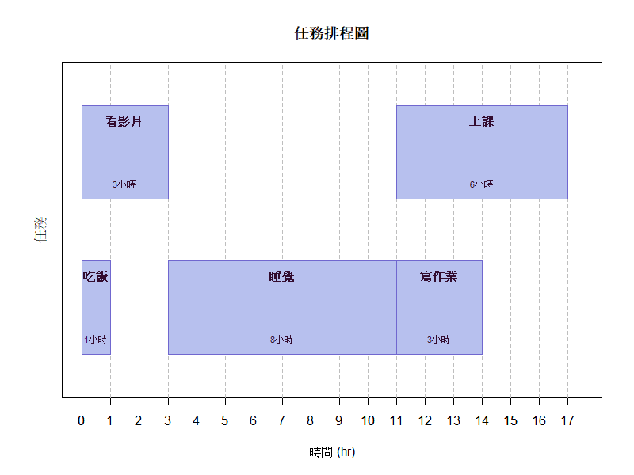

# Time_Schedule
## 簡介
有時候事情一多，容易陷入不知道該從哪裡開始的困境，甚至拖延或草率完成任務。長期下來，可能導致壓力過大、睡眠不足，進而影響工作效率。本專案使用 R 語言開發一款排程工具，能根據各項任務的耗時及前後依賴關係，自動計算完成所有任務所需的最短時間，並繪製清晰的時間分配圖表。此工具有助於提升單位時間的生產力，協助使用者更有效率地規劃與執行工作。

## 功能特色

- ✅ 自動計算每件事最早可以開始的時間
- ✅ 考慮任務之間的先後依賴
- ✅ 用簡單條狀圖顯示時間分配

## 範例
以下為本專案中所使用的任務清單，包含每個任務的耗時及其執行條件（依賴關係）。依賴條件代表該任務必須在其他任務完成後才能開始。

| 事件   | 耗時 (hr) | 條件          |
|--------|------------|-------------------|
| 吃飯   | 1          |                   |
| 上課   | 6          | 睡覺後執行         |
| 看影片 | 3          |                   |
| 睡覺   | 8          | 吃飯和看影片後執行  |
| 寫作業 | 3          | 睡覺後執行         |

##
執行排程工具後，程式會計算出所有任務的最早開始時間，並繪製排程圖，清楚呈現各任務的時間分配及可併行情況。下圖展示了本範例的排程結果：

完成所有任務最短時間: 17小時
